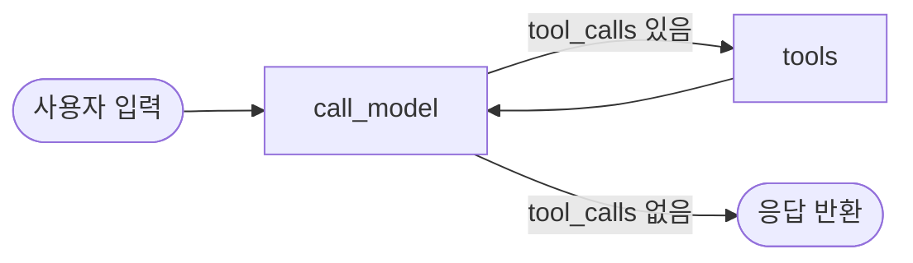

# claude-aiagent-starterkit

LangGraph + OpenAI 기반 AI 에이전트 스타터킷입니다. 매번 반복하는 초기 세팅(모델 연결, 도구 정의, 에이전트 루프 구성)을 줄이기 위한 최소 예제로, CLI와 Streamlit 웹 UI 둘 다 제공합니다.

> 저장소 이름은 `claude-aiagent-starterkit`이지만, 현재 구현은 **OpenAI**를 기본 프로바이더로 사용합니다. 이유와 Claude로 되돌리는 방법은 [나중에 Claude로 전환하는 법](#나중에-claude로-전환하는-법)을 참고하세요.

## 설치 및 실행

```bash
python3 -m venv .venv && source .venv/bin/activate
pip install -r requirements.txt
cp .env.example .env
# .env 파일을 열어 OPENAI_API_KEY를 채워넣으세요
```

> macOS(Homebrew Python) 등 일부 환경은 PEP 668로 전역 `pip install`을 막습니다. 이때는 위처럼 가상환경을 먼저 만들어야 합니다.

**CLI로 실행:**

```bash
python main.py
```

**Streamlit 웹 UI로 실행:**

```bash
streamlit run app.py
```

`TAVILY_API_KEY`를 설정하지 않으면 웹 검색 도구는 안내 메시지만 반환하고, 나머지 기능(계산기, 파일 읽기)은 정상 동작합니다.

### 선택적 환경변수

| 변수 | 기본값 | 설명 |
|---|---|---|
| `RECURSION_LIMIT` | `25` | `call_model ↔ tools` 최대 왕복 횟수. 모델이 도구 호출을 무한 반복하는 걸 방지하는 안전장치 |
| `CHECKPOINTER_BACKEND` | `memory` | `sqlite`로 바꾸면 대화 기록을 `checkpoints.db` 파일에 영속 저장 (재시작해도 유지) |
| `LANGCHAIN_TRACING_V2` | (미설정) | `true`로 설정하면 [LangSmith](https://smith.langchain.com)에서 도구 호출/토큰/비용을 자동으로 추적. `LANGCHAIN_API_KEY`, `LANGCHAIN_PROJECT`와 함께 설정 |

## 아키텍처

에이전트는 "모델 호출 ↔ 도구 실행"을 반복하는 LangGraph 상태 그래프입니다.



- `call_model`: `ChatOpenAI`에 도구 4개를 `bind_tools()`로 연결해 호출
- `tools`: `langgraph.prebuilt.ToolNode`가 모델이 요청한 도구를 실제로 실행
- 라우팅은 `langgraph.prebuilt.tools_condition`(공식 헬퍼)이 담당 — 도구 호출 요청이 있으면 `tools`로, 없으면 종료
- 체크포인터가 `thread_id` 기준으로 대화 맥락을 유지 (CLI는 고정된 `"cli-session"`, Streamlit은 브라우저 세션마다 새 UUID). 기본은 `InMemorySaver`, `CHECKPOINTER_BACKEND=sqlite`로 `SqliteSaver` 전환 가능
- `main.py`/`app.py`는 `graph.invoke()`가 아니라 `graph.stream(..., stream_mode="messages")`로 토큰을 실시간 출력한다. `AIMessageChunk`를 `chunk_position == "last"`가 될 때까지 누적해 `tool_calls`를 재구성하는 [LangChain 공식 스트리밍 패턴](https://docs.langchain.com/oss/python/langchain/streaming)을 따른다

## 예제 도구 4개

| 파일 | 도구 | 특징 |
|---|---|---|
| `src/tools/calculator.py` | `calculator` | 외부 의존성 없음. `eval()` 대신 `ast` 기반 안전한 파서 사용 |
| `src/tools/web_search.py` | `web_search` | Tavily API 호출. API 키 없으면 안내 메시지 반환 |
| `src/tools/file_tools.py` | `read_local_file` | `./workspace` 디렉터리로 샌드박싱, 경로 순회 공격(`../` 등) 차단 |
| `src/tools/time.py` | `get_current_time` | 외부 의존성 없음. 표준 라이브러리 `zoneinfo`로 타임존별 현재 시각 반환 |

## 테스트 & 린트

```bash
pip install -r requirements-dev.txt
pytest      # 도구 단위 테스트 (calculator, read_local_file의 경로 탈출 방지 등)
ruff check .
```

`.github/workflows/ci.yml`이 push/PR마다 동일하게 실행합니다. API 키 없이도 통과합니다(모델을 호출하지 않는 순수 함수만 테스트).

## 새 도구 추가하는 법

1. `src/tools/`에 새 파일을 만들고 `@tool` 데코레이터로 함수를 정의합니다 (기존 도구 참고).
2. `src/tools/__init__.py`의 import와 `ALL_TOOLS` 리스트에 추가합니다.
3. 끝입니다 — `graph.py`는 `ALL_TOOLS`를 그대로 참조하므로 별도 수정이 필요 없습니다.

바로 위 3단계를 자동화한 Claude Code 커스텀 커맨드가 `/add-tool`입니다. 아래 참고.

## Claude Code 커스텀 커맨드

`.claude/commands/`에 이 프로젝트 전용 슬래시 커맨드 3개가 있습니다. Claude Code에서 그대로 입력하면 실행됩니다.

| 커맨드 | 설명 |
|---|---|
| `/add-tool <이름> <설명>` | 기존 도구(`calculator`/`web_search`/`file_tools`) 관례를 따라 `src/tools/<이름>.py` 생성, `ALL_TOOLS` 등록, `tests/test_<이름>.py` 작성까지 한 번에 수행. 위 "새 도구 추가하는 법" 3단계를 자동화한 버전 |
| `/verify` | `pytest` → `ruff check .` → `build_graph()` 스모크 테스트를 순서대로 실행하고 결과를 표로 요약. 커밋 전 로컬 검증용 |
| `/inspect-thread <thread_id>` | `CHECKPOINTER_BACKEND=sqlite`로 저장된 `checkpoints.db`에서 특정 대화 기록을 디코딩해서 사람이 읽을 수 있게 출력 (원시 테이블은 직렬화된 바이너리라 sqlite CLI로 직접 못 읽음) |

예시:
```
/add-tool weather "OpenWeather API로 현재 날씨를 조회하는 도구"
/verify
/inspect-thread 66538845-f816-435d-ac09-61fcdfb5a369
```

## 나중에 Claude로 전환하는 법

LangGraph/LangChain은 provider-agnostic이라 모델 부분만 교체하면 됩니다.

1. `pip install langchain-anthropic` (원한다면 `requirements.txt`에서 `langchain-openai`를 빼도 됩니다)
2. `src/graph.py`에서 `ChatOpenAI` → `ChatAnthropic` 로 교체:
   ```python
   from langchain_anthropic import ChatAnthropic

   model = ChatAnthropic(model="claude-opus-5", max_tokens=MAX_TOKENS).bind_tools(ALL_TOOLS)
   ```
3. `.env`에 `ANTHROPIC_API_KEY`를 추가합니다.

**주의:** Claude Opus 5는 `temperature`/`top_p`/`top_k` 파라미터를 거부합니다(요청이 400으로 실패). 이 스타터킷은 두 프로바이더 모두에서 이 값들을 설정하지 않으므로 그대로 두면 됩니다.

## 제약사항

- 기본 체크포인터(`InMemorySaver`)는 프로세스 메모리에만 저장되는 **데모/개발용**입니다. 재시작하면 대화가 사라집니다. `CHECKPOINTER_BACKEND=sqlite`로 로컬 파일 영속화는 가능하지만, 여러 서버 인스턴스가 상태를 공유해야 하는 진짜 프로덕션 환경이라면 `PostgresSaver` 등으로 교체하세요.
- 인증, 데이터베이스, 배포 설정은 이 스타터킷 범위 밖입니다.
